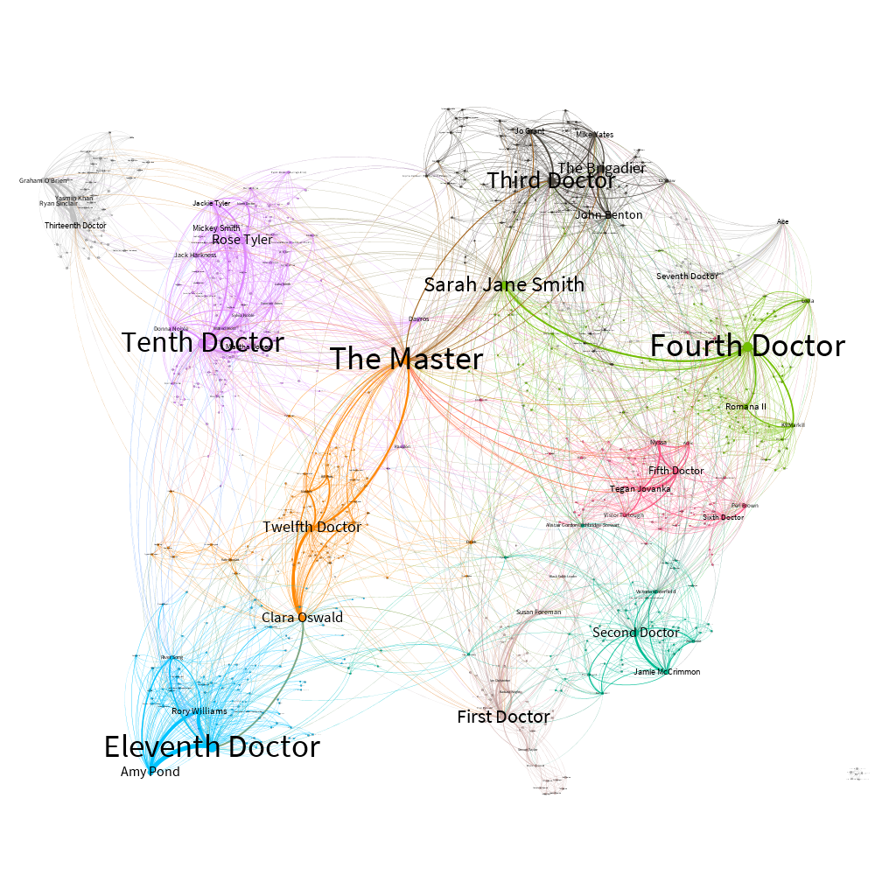

# Doctor Who dataset
Collection of datasets about information and interactions between Doctor Who characters from 1963 to April 2021.  
Visualization of the constructed interaction graph between the characters in Gephi:

- Nodes are the larger the higher their degree centrality value.  
- Edges are the thicker the higher their weight.  
- Nodes and Edges are colored according to the community partition provided by the Louvain algorithm.  
## Usage
You can simply clone this repository and use CSVs in the dataset folder as you like.  
If you want to easily load the doctor who interactions graph/multigraph as ``networkx`` object, you can use the ``doctorwho_dataset.py`` utilities. The utilities are described through docstrings in the py file itself. An example of using these utilities is provided in the jupyter notebook ``DEMO.ipynb``.  

Please link this repo in your references.
## Datasets available
The Doctor Who simple graph is an undirected weighted graph where nodes are characters with information about their roles in the series and exist an edge between node i and node j with weight w iff i and j appear in the same episode w times.  

The Doctor Who multigraph is an undirected multigraph where nodes are characters with information about their roles in the series and exist an edge between node i and node j iff i and j appear in the same episode and the edge is marked with the title of the episode.  

The edgelist of doctor who simple graph is available in csv in datasets folder. The edgelist of doctor who multigraph is available in csv in datasets/multigraph/ folder. The informations associated to nodes(characters), that is roles in the show, are available in datasets/roles/ folder. Two subdatasets relating to the classic and new era of Doctor Who are also available for each type of dataset mentioned.  
## Source and preprocessing information
Characters, roles, interactions, episodes were obtained by scraping from the [Doctor Who Wiki](https://tardis.fandom.com/wiki/Doctor_Who_Wiki). The process by which I extracted the information can be summarized in the following steps:
- Starting from the page containing the [list of all the episodes](https://tardis.fandom.com/wiki/List_of_Doctor_Who_television_stories), the crawler visited the page dedicated to each story.  
- For each episode I have extrapolated from the \<aside\> on the right side of the page the values of 'Doctor', 'Companion(s)', 'Featuring', 'Main enemy' rows, that are the main characters in the episode, storing \(name,their role\), and creating a link between each characters labeled with the name of the episode.  

Most of the specials and mini-episodes are included in the dataset. I decided to exclude The\_Curse\_of\_Fatal\_Death and Scream\_of\_the\_Shalka due to issues related to the continuity of the Doctor's story.  

Regarding the preprocessing, I did a cleanup of some garbage rows, I eliminated duplicate links, I rewrote the pairs (character, role) as pairs (character, list\_of\_roles).  
## Replicate the data gathering process
I also made public the scripts and code with which I scraped and preprocessed the data. If you want to replicate the data gathering process, you can use ``scraping.py`` to obtain the data from the wiki and ``preprocessing.py`` to clean the datasets. This two py file are available in code\_to\_replicate folder. Please note that some cleaning operations were done manually. I am referring to operations of merge and delete of rows of the edgelist due to bad split on commas. The bad episodes are as follows:
- The Two Doctors\(exchange columns 2,3,4\).  
- Aliens The Good The Bad The Ugly\(delete some rows\).  
- Religion Myths and Legend\(delete some rows\).  
- Elio Ello Utopia\(delete some rows\).  
- The_Doctor_the_Widow_and_the_Wardrobe_(TV_story)\(merge columns 3,4\).  
- Prequel The_Doctor_the_Widow_and_the_Wardrobe_(TV_story)\(delete\).  
- She_Said_He_Said:_A_Prequel_(webcast)\(merge columns 3,4\).  

If you want more information drop a mail to dileomanuel0 at gmail dot com :)
